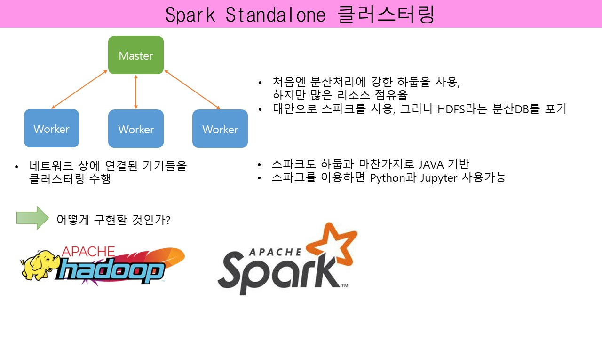
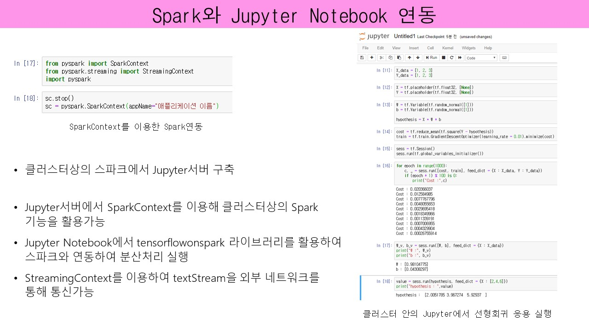
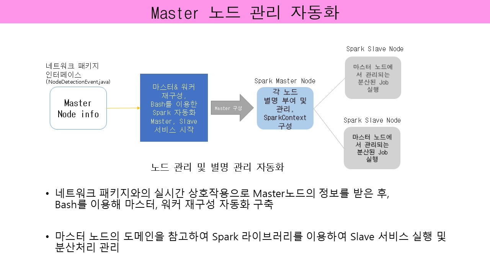

# 프로젝트 개요 #
- 본 프로젝트는 같은 네트워크상에 있는 IOT 컴퓨팅 장비들을 apache-spark를 이용하여 자동 클러스터링
- 클러스터 상에서 pyspark를 사용하여 tensorflow와 jupyter notebook을 사용할수 있게 한다.
# 개발환경 #
- o/s : ubuntu
- 언어 : java, bash
- 기술 : spark

# 최동우의 담당 #
- spark와 관련된 모듈 개발
- bash script를 이용하여 router, network 시스템 파일 관리, apache-spark 관리 자동화
- bash script를 이용하여 프로젝트 설치 및 환경 설정 자동화

# 관련 내용 #

# 참고 #
- **수상 내역** &nbsp;&nbsp;&nbsp;&nbsp;
18.12.03 연합대학 SW프로젝트 발표회 우수상 - 지역선도대학 육성사업  &nbsp;&nbsp;&nbsp;&nbsp;
18.11.23 연합대학 SW동아리 경진대회 장려상 - 충북대학교 지역선도대학

- **프로젝트 팀원**
 &nbsp;&nbsp;&nbsp;&nbsp;linux, spark : 최동우
 &nbsp;&nbsp;&nbsp;&nbsp;네트워크, 시스템 : 엄선용
 &nbsp;&nbsp;&nbsp;&nbsp;AI : 박현준
